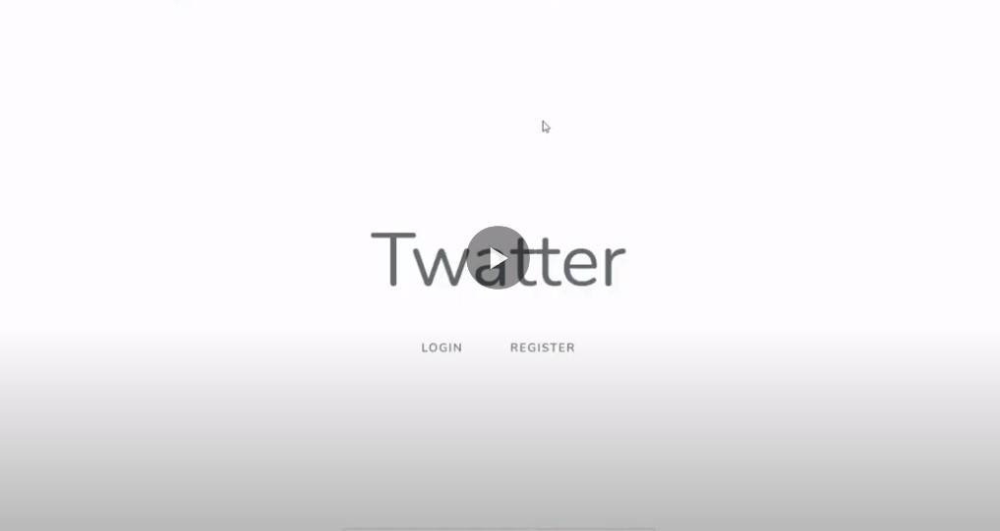
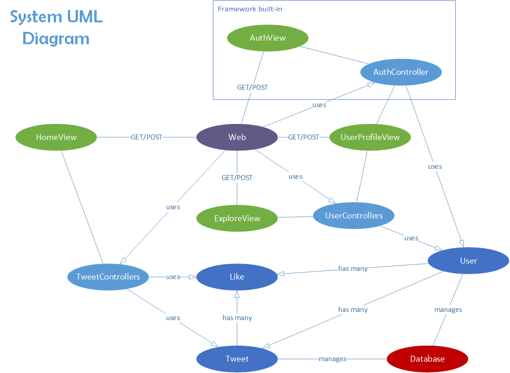
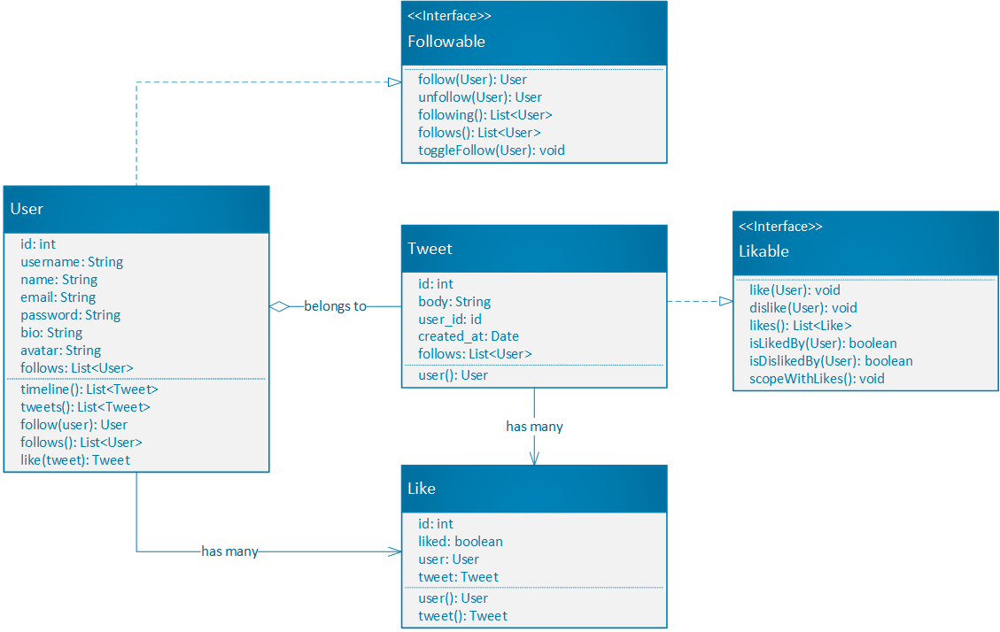

# Twatter App

> Twatter is a clone of Twitter, minimalistic and simpler version of it. This web application was developed using Laravel, popular PHP based framework for building backend web applications. It was entirely made by me as part of my academic project for the Software Engineering I course, in fall 2020, San Jose State University.

In this web application, users can create new accounts or sign in to their existing accounts, manage personal profile, set avater, post tweets, view friends' tweets, explore other users, view and follow other users, like/dislike tweets. Below are the screen recording of the application:

## Screen Recorded Demo

## Architectural Design

Architecture of the software is based on Laravel, PHP-based framework for creating MVC web applications. The models in our applications are: User, model that describes users, and Tweet, model that describes tweets (posts). The views (browser web pages) are controlled through controllers that directly access models. Controller access and distribution is done through the routes file (web.php), which handles POST and GET requests. Models are accessed through and saved in database tables, which are created through migrations files using php artisan, a command tool provided by the Laravel framework. In addition, the authentication API will also be provided and integrated through Laravel during the creation of the application.

Here is the top-level system design:

## Data Modeling

Model User describes a user who created his account through authentication. It contains id of the user, name, email, password, bio, and avatar (profile picture). In addition, user has his own many tweets and followings (other users whom the user follows). User can follow another user, return his tweets, return his timeline (tweets of the user and of his followings), return his followings (users whom he follows), and like/dislike Tweets. User implements Followable trait.

Model Tweet describes a tweet (post) that was created by a user. It contains the id of the tweet, its title, text body, date of creation, and id of the user to whom it belongs. User and Tweet are connected with a “has many” relationship. Tweet can return the user it belongs to and return likes and dislikes it has. Tweet implements Likable trait.

Model Like describes a like/dislike on certain Tweet done by a certain User. It contains its id and a boolean, which describes if it's a like or dislike, and ids of the tweet and user it belongs to. Tweet and User have many Likes. Like can return the User and Tweet it belongs to.

Here is a class diagram describing models:

Models implement Laravel’s Eloquent ORM, which is a simple and beautiful way of implementing ActiveRecord for working with databases. Both models have database tables (users_table and tweets_table), which are created and changed through migration files, which is an easier way of initial database management for major changes, provided by the framework. The type of database management system for this project will be MySQL.

## Software Analysis

For the backend, MVC pattern was chosen as the core of the software design. Model-View-Controller software architecture pattern is the best possible pattern for this type of applications, where user interacts with interface, by viewing, creating, or updating different objects. Essentially, it will be our backend software, specifically, models and controllers that will manage the website.

In addition, the architecture is standard for the projects built using Laravel framework. While Laravel is simpler to use PHP framework compared to others, it is also very suitable for creating PHP MVC web applications that are of medium or smaller scale; large scale social network applications, like Facebook, should not be written in Laravel. Overall, it is not the most efficient or secure, but it is also not worst, and it is not hard to integrate, which makes it the best fit for this project.
    
The front-end is built using Html/CSS and PHP with Laravel’s Blade Markup integration. While Html and CSS is standard for building web pages, PHP is standard for making pages dynamic. The web pages are also protected from SQL injections and errors by using CSRF token protection and error checking when filling forms. In case of errors, like making unauthorized actions, will through a corresponding error page (in this case, it will be the error 403).

## License

The Laravel framework is open-sourced software licensed under the [MIT license](https://opensource.org/licenses/MIT).
